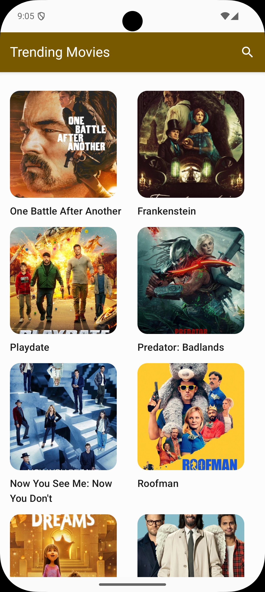
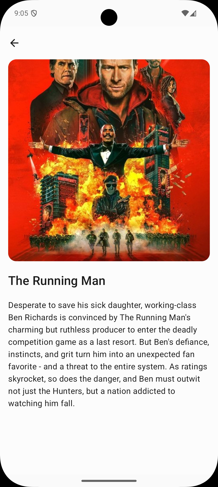

# Movie DB App

A simple Android application built using 100% Kotlin and Jetpack Compose to browse and search for
movies. This app is built with modern Android development practices, focusing on a clean, scalable,
and modular architecture.

---

## 📸 Screenshots

|                                      Movie List Screen                                      |                                      Movie Detail Screen                                      |
|:-------------------------------------------------------------------------------------------:|:---------------------------------------------------------------------------------------------:|
|  |  |

---

## ✨ Features

* **Movie List Screen**:
    * Displays a grid of popular movies.
    * Handles loading, error, and empty UI states gracefully.
    * Includes a search bar to find movies by title.
* **Movie Detail Screen**:
    * Shows comprehensive details for a movie selected from the list.

---

## 🛠️ Tech Stack & Architecture

This project follows a modular, clean architecture approach, separating concerns for better
maintainability and testability.

### Core Technologies

* **[Kotlin](https://kotlinlang.org/)**: First-party and official programming language for Android
  development.
* **[Jetpack Compose](https://developer.android.com/jetpack/compose)**: Modern toolkit for building
  native Android UI.
* **[Retrofit](https://square.github.io/retrofit/) & [OkHttp](https://square.github.io/okhttp/)**:
  For declarative networking and handling HTTP requests.
* **[Room](https://developer.android.com/jetpack/androidx/releases/room)**: Local database for
  caching movie data.
* **[Hilt](https://developer.android.com/training/dependency-injection/hilt-android)**: For
  dependency injection.
* **[Jetpack Navigation](https://developer.android.com/jetpack/compose/navigation)**: For handling
  navigation between Composable screens.

### Project Modules

The project is divided into two main modules:

* **`:app` Module**
    * This is the main application module that the user installs.
    * It handles all UI-related logic, including Composable screens, ViewModels, and UI state.
    * Manages all navigation using the Jetpack Navigation graph.

* **`:data` Module**
    * This module contains the core business logic.
    * It handles all data operations, including API calls (Retrofit) and local database storage (
      Room).
    * Exposes `Repositories` for the `:app` module to consume, abstracting the data sources.

---

## 🚀 Setup and Installation

To build and run this project, you will need to provide your own API key
from [The Movie DB (TMDB)](https://www.themoviedb.org/documentation/api).

1. **Clone the repository:**
   ```bash
   git clone https://github.com/IronClad1607/atlys-assignment
   ```

2. **Get your API Key:**
    * Create an account on [TMDB](https://www.themoviedb.org/).
    * Go to your account settings, find the "API" section, and register for a v3 auth key.
    * Or you can copy-paste the api key present inside [Auth File](auth_file.txt).

3. **Add your API Key to `local.properties`:**
    * In the root directory of the project, create a file named `local.properties`.
    * Add your API key to this file. This file is included in `.gitignore` by default to keep your
      key secure.

   ```properties
   # TMDB API Key
   apiKey="YOUR_API_KEY_GOES_HERE"
   ```

4. **Build and Run:**
    * Open the project in Android Studio.
    * Let Gradle sync all the dependencies.
    * Build and run the app on an emulator or a physical device.

---

## 🤖 AI in this Project

In today's development landscape, leveraging AI gives developers an edge in building more scalable, performant, and robust applications:

* **UI/UX Generation**: Generated the complete UI for the app, including both light and dark themes.
* **Asset Creation**: Created the application's logo.
* **Code Readability**: Added comments and documentation throughout the files to improve code readability and maintainability.
* **Debugging**: Assisted in debugging a few crashes and unexpected behaviors encountered during development.
* **Network Layer**: Helped create a generic network response call and adapter to streamline API integration.

---